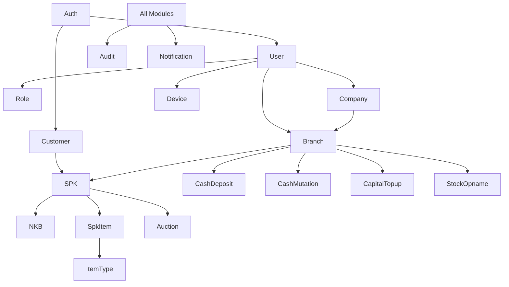

# Module Documentation Index

This directory contains detailed technical documentation for each module in the GadaiTop API.

## Core Modules

### [Auth Module](./auth.md)
Authentication and authorization system with JWT tokens, password management, email verification, and device registration.

**Key Features**:
- User & customer authentication
- JWT token management
- Password reset flows
- Device registration (IP-based)
- Account locking after failed attempts

### [User Module](./user.md)
User management and CRUD operations for system users.

**Key Features**:
- User creation and management
- Role assignment
- Profile management
- Password management
- User activation/deactivation

### [Role Module](./role.md)
Role-based access control (RBAC) system.

**Key Features**:
- Role creation and management
- Permission assignment
- Role-based authorization
- Hierarchical roles

### [Company Module](./company.md)
Company/organization management and configuration.

**Key Features**:
- Company profile management
- Interest rate configuration
- Fee configuration
- Company statistics

### [Branch Module](./branch.md)
Branch/store management for multi-location operations.

**Key Features**:
- Branch creation and management
- Branch status workflow
- Borrow request (Pinjam PT)
- Branch statistics

## Business Modules

### [Customer Module](./customer.md)
Customer management for pawn transactions.

**Key Features**:
- Customer registration
- KYC data management
- PIN management
- Customer history

### [SPK Module](./spk.md)
Surat Perjanjian Kredit (Pawn Agreement) management.

**Key Features**:
- SPK creation and confirmation
- Interest calculation
- SPK extension
- SPK redemption
- Transaction history

### [NKB Module](./nkb.md)
Nota Kredit Barang (Item Credit Note) for all financial transactions.

**Key Features**:
- Transaction recording
- Payment tracking
- Receipt generation
- Transaction history

### [Pawn Term Module](./pawn-term.md)
Pawn term configuration and management.

**Key Features**:
- Term definition
- Interest rate configuration
- Grace period settings

### [Auction Module](./auction.md)
Auction management for unredeemed items.

**Key Features**:
- Auction batch creation
- Item management
- Bidding system
- Auction settlement

### [Catalog Module](./catalog.md)
Product catalog for item valuation.

**Key Features**:
- Catalog item management
- Price history tracking
- Item categorization

## Financial Modules

### [Cash Deposit Module](./cash-deposit.md)
Cash deposit management for branch operations.

**Key Features**:
- Deposit recording
- Deposit approval workflow
- Deposit history

### [Cash Mutation Module](./cash-mutation.md)
Cash flow tracking and reconciliation.

**Key Features**:
- Cash movement tracking
- Balance reconciliation
- Mutation reports

### [Capital Topup Module](./capital-topup.md)
Capital top-up management for branches.

**Key Features**:
- Top-up request creation
- Approval workflow
- Top-up history

## Inventory Modules

### [Item Type Module](./item-type.md)
Item type master data management.

**Key Features**:
- Item type creation
- Category management
- Icon/image management

### [Stock Opname Module](./stock-opname.md)
Stock taking and inventory count.

**Key Features**:
- Stock count sessions
- Item verification
- Discrepancy reporting
- Priority rules

## System Modules

### [Audit Module](./audit.md)
Comprehensive audit logging system.

**Key Features**:
- Action logging
- Change tracking
- User activity monitoring
- Audit reports

### [Device Module](./device.md)
Device registration and verification (MAC address locking).

**Key Features**:
- Device registration
- IP address verification
- Device management
- Security enforcement

### [Notification Module](./notification.md)
Notification system for users and customers.

**Key Features**:
- In-app notifications
- Email notifications
- SMS notifications
- Notification templates

### [Borrow Request Module](./borrow-request.md)
Branch borrowing system (Pinjam PT).

**Key Features**:
- Borrow request creation
- Approval workflow
- Request tracking

### [Report Module](./report.md)
Reporting and analytics.

**Key Features**:
- Financial reports
- Transaction reports
- Inventory reports
- Custom reports

### [Dashboard Module](./dashboard.md)
Dashboard analytics and KPIs.

**Key Features**:
- Real-time statistics
- Performance metrics
- Visual analytics

### [Upload Module](./upload.md)
File upload and management.

**Key Features**:
- Image upload
- Document upload
- File validation
- Storage management

### [Scheduler Module](./scheduler.md)
Scheduled tasks and background jobs.

**Key Features**:
- Cron job management
- Task scheduling
- Job monitoring

### [Health Checker Module](./health-checker.md)
System health monitoring.

**Key Features**:
- Database health check
- Memory monitoring
- Service availability

## Module Relationships

## Common Patterns

### Authentication
All protected endpoints require JWT authentication via the Auth module.

### Authorization
Role-based access control is enforced via the Role module.

### Audit Logging
All significant operations are logged via the Audit module.

### Pagination
List endpoints support pagination with `page` and `pageSize` parameters.

### Soft Delete
Most entities support soft delete to maintain data integrity.

### UUID Primary Keys
All entities use UUID as primary keys for better distribution.

## Development Guidelines

1. **Follow NestJS conventions** for module structure
2. **Use DTOs** for request/response validation
3. **Implement proper error handling** with custom exceptions
4. **Write comprehensive tests** for all modules
5. **Document all endpoints** with proper descriptions
6. **Use transactions** for multi-step operations
7. **Implement audit logging** for sensitive operations
8. **Follow security best practices** for authentication and authorization

## Testing

Each module should have:
- Unit tests for services
- Integration tests for controllers
- E2E tests for critical flows

## Documentation Standards

Each module documentation should include:
- Overview and features
- Entity structure
- API endpoints
- Business logic
- DTOs
- Related modules
- Error handling
- Configuration
- Best practices
