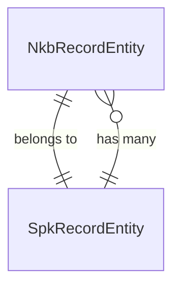
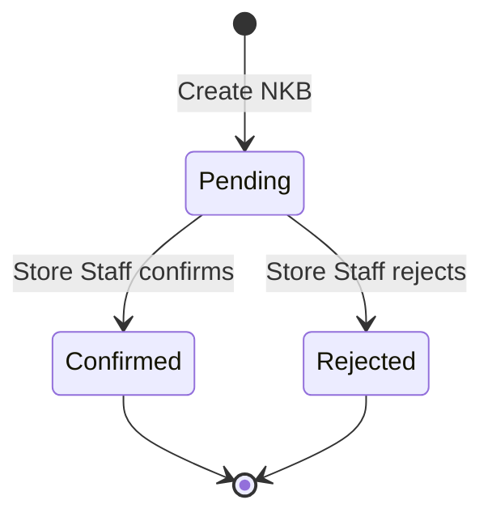

# NKB Module

## Overview

The NKB (Nota Kredit Barang) module handles payment transactions for pawn contracts (SPK). NKB records customer payments including renewals (perpanjangan) and redemptions (penebusan). Store Staff creates and processes NKB, while the system automatically updates SPK balances on confirmation.

## Features

- **Payment Recording**: Create NKB for SPK payments
- **Confirm/Reject Workflow**: Store Staff confirms or rejects pending payments
- **SPK Balance Updates**: Auto-update remaining balance on confirmation
- **Redemption Detection**: Auto-mark SPK as redeemed when fully paid
- **Payment Types**: Supports renewal, redemption, partial payments
- **Multi-tenant Scoping**: Filtered by PT and branch

## Architecture

### Entity: NkbRecordEntity

**File**: `entities/nkb-record.entity.ts`

| Field | Type | Description |
|-------|------|-------------|
| `nkbNumber` | string | Unique NKB number (auto-generated) |
| `spkId` | UUID | Related SPK record |
| `amountPaid` | decimal | Payment amount |
| `paymentType` | enum | renewal, redemption, partial |
| `paymentMethod` | enum | cash, transfer, qris, etc. |
| `status` | enum | pending, confirmed, rejected |
| `confirmedBy` | UUID | User who confirmed/rejected |
| `confirmedAt` | timestamp | When confirmed/rejected |
| `rejectionReason` | text | Reason if rejected |
| `isCustomerInitiated` | boolean | True if initiated by customer |
| `createdBy` | UUID | User who created NKB |

### Relationships



## API Endpoints

| Method | Endpoint | Description | Auth |
|--------|----------|-------------|------|
| GET | `/v1/nkb` | List NKB records (paginated) | Yes |
| GET | `/v1/nkb/:id` | Get NKB details | Yes |
| POST | `/v1/nkb` | Create new NKB | Yes |
| PUT | `/v1/nkb/:id/confirm` | Confirm pending NKB | Yes |
| PUT | `/v1/nkb/:id/reject` | Reject pending NKB | Yes |

## DTOs

### CreateNkbDto

```typescript
{
  spkId: string;           // Required, UUID of SPK
  amountPaid: number;      // Required, payment amount
  paymentType: 'renewal' | 'redemption' | 'partial';
  paymentMethod?: string;  // Optional, payment method
}
```

### QueryNkbDto

```typescript
{
  page?: number;
  take?: number;
  ptId?: string;
  branchId?: string;
  spkId?: string;          // Filter by SPK
  status?: 'pending' | 'confirmed' | 'rejected';
  paymentType?: string;
  sortBy?: string;
  order?: 'ASC' | 'DESC';
}
```

### RejectNkbDto

```typescript
{
  reason?: string;  // Optional rejection reason
}
```

## Usage Examples

### Create NKB (Renewal)

```http
POST /v1/nkb
Authorization: Bearer <token>
Content-Type: application/json

{
  "spkId": "uuid-of-spk",
  "amountPaid": 500000,
  "paymentType": "renewal",
  "paymentMethod": "cash"
}
```

### Confirm NKB

```http
PUT /v1/nkb/:id/confirm
Authorization: Bearer <token>
```

Response:
```json
{
  "data": {
    "uuid": "nkb-uuid",
    "nkbNumber": "NKB20260204123456",
    "status": "confirmed",
    "confirmedAt": "2026-02-04T07:00:00Z"
  }
}
```

### Reject NKB

```http
PUT /v1/nkb/:id/reject
Authorization: Bearer <token>
Content-Type: application/json

{
  "reason": "Payment amount incorrect"
}
```

## Business Logic

### NKB Workflow



### SPK Balance Update

On NKB confirmation:
1. Calculate new remaining balance: `SPK.remainingBalance - NKB.amountPaid`
2. If remaining ≤ 0: Mark SPK as `Redeemed`
3. If renewal and balance > 0: Mark SPK as `Extended`
4. Save updated SPK

### NKB Number Generation

Format: `NKB{YYYYMMDD}{6-digit-random}`

Example: `NKB20260204583291`

### Validation Rules

- SPK must be `Active` or `Extended` to create NKB
- Only `Pending` NKB can be confirmed/rejected
- Amount paid cannot exceed remaining balance (business rule)

## Error Handling

| Error | Code | Description |
|-------|------|-------------|
| NKB not found | 404 | UUID doesn't exist |
| SPK not found | 404 | Related SPK doesn't exist |
| SPK not active | 400 | SPK is not in active/extended status |
| Not pending | 400 | NKB is not in pending status |

## Related Modules

- **SPK Module**: NKB updates SPK balances
- **Customer Module**: SPK owner information
- **Branch Module**: Store-level filtering

## Feature Specification Reference

| Spec File | Description |
|-----------|-------------|
| [`store-staff-nkb-management.md`](file:///Users/travis/Work/gadaitop/gadaitop-monorepo/feature_specifications/transactions/nkb/store-staff-nkb-management.md) | Store Staff NKB processing |

## Required Permissions

Based on [`roles-and-permissions.md`](file:///Users/travis/Work/gadaitop/gadaitop-monorepo/feature_specifications/docs/roles-and-permissions.md):

| Role | Permission |
|------|------------|
| Store Staff | CRUD (create, confirm, reject) |
| Admin PT | READ only (oversight) |
| Customer | Initiate payments via portal |
