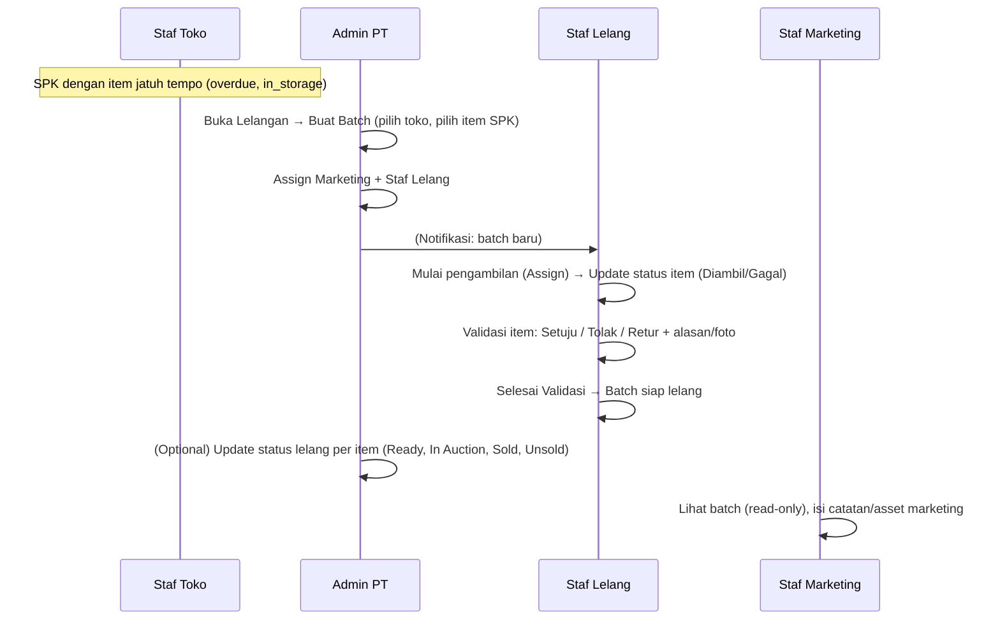

# End-to-End Test: Flow Lelangan (Auction)

This document describes how to test the **Lelangan** (auction) flow end-to-end for all roles. Use it as a manual test guide or as a reference for automated E2E tests.

---

## 1. Prerequisites

### 1.1 Environment

- Backend API running: `pnpm dev:api` (port 3001)
- Frontend running: `pnpm dev:web` (port 3000)
- Database migrated and seeded (overdue SPKs and auction batches exist)

### 1.2 Seed data (from seeders)

Ensure you have run:

- Role seed
- User seed (including admin users per PT)
- Overdue SPK seed (SPK with status `overdue` and items `in_storage`)
- Auction batch seed (creates batches in various statuses per store)

### 1.3 Test users (from `admin-users.seed`)

| Role            | Example email           | Company | Use for |
|----------------|------------------------|---------|--------|
| Super Admin    | (owner user from user seed) | -       | Optional; not required for lelangan flow |
| Admin PT      | admin.pt001@test.com   | PT001   | Create batch, assign staff, edit, cancel, set item auction status |
| Staf Toko      | staff.jkt001@test.com  | PT001, branch JKT001 | Create SPK / context only; no direct lelangan actions |
| Staf Lelang    | lelang.pt001@test.com  | PT001   | Validasi Lelangan: validate items, finalize, scan QR |
| Staf Marketing | marketing.pt001@test.com | PT001 | Lelangan: view only + marketing notes/assets |

Default password for seeded users is usually defined in the seed (e.g. a shared test password). If not, set/reset via your auth flow.

---

## 2. Flow overview

**High-level steps:**

1. **Admin PT** creates an auction batch from Lelangan (tab "Batch Lelang SPK"): select PT, store, overdue SPK items, optional name/notes, assign Marketing and Staf Lelang.
2. **Staf Lelang** and **Staf Marketing** receive a notification; they see the batch in Validasi Lelangan (Staf Lelang) and Lelangan (Staf Marketing).
3. **Staf Lelang** opens batch → starts pickup (Assign) → updates each item as Diambil or Gagal → then validates each item (Setuju / Tolak / Retur with reason/photos) → clicks "Selesai Validasi" when all items are decided.
4. **Staf Marketing** can open the same batch (read-only), add batch-level and item-level marketing notes/assets.
5. **Admin PT** can edit batch (name, notes, schedule date, assignees) while draft/pickup; cancel batch; and when batch is "Siap Lelang", update per-item auction status (Ready, In Auction, Sold, Unsold).

---

## 3. Role-by-role test steps

### 3.1 Super Admin (owner)

- **Menu:** Dashboard, Master Super Admin, Master PT, Master Tipe Barang. No Lelangan or Validasi Lelangan.
- **What to do:** Log in as owner → confirm no "Lelangan" or "Validasi Lelang" in sidebar. No E2E steps required for lelangan flow.

---

### 3.2 Admin PT (company_admin)

**Login:** e.g. `admin.pt001@test.com`

#### 3.2.1 View Lelangan list

1. Go to **Lelangan** from sidebar.
2. Switch to tab **"Batch Lelang SPK"**.
3. **Verify:** Table shows columns: No, ID Batch, Nama Batch, Status, Penanggung Jawab, Toko, Tanggal & Waktu, Jumlah Item, Last Updated At. Data loads with pagination.
4. **Verify:** Filter (Toko, Status) works if implemented; search works.

#### 3.2.2 Create a new batch

1. On Lelangan, tab **"SPK Jatuh Tempo"**: ensure there are overdue SPK items (if not, create an overdue SPK first as Staf Toko / data setup).
2. Select PT and optionally filter by branch. Select one or more items from the table (checkboxes).
3. Click **"Buat Batch"**.
4. In the dialog: choose **Toko** (store), enter **Nama batch** and **Notes** (optional), select **Staf Marketing** and **Staf Lelang** (assignees).
5. Click **Simpan** (and confirm if there is a confirmation dialog).
6. **Verify:** New batch appears in "Batch Lelang SPK" with status **Draft**; assignees receive a notification.

#### 3.2.3 Edit batch (draft or pickup in progress)

1. Click a row of a batch in status **Draft** or **Diambil** to open batch detail.
2. Click **Edit** (or "Edit Batch").
3. Change name, notes, or **Jadwal** (schedule date) if the field exists; optionally change assignees.
4. Save and confirm.
5. **Verify:** Batch detail shows updated data.

#### 3.2.4 Assign (start pickup) – optional

- If your app allows Admin PT to "Assign" the batch to start pickup, do it and verify status moves to "Diambil". Otherwise this step is done by Staf Lelang (see 3.4).

#### 3.2.5 Cancel batch

1. Open a batch that is **Draft** or **Diambil** or **Validasi** (not yet "Siap Lelang").
2. Use **Cancel** / **Batalkan** action.
3. Confirm in dialog.
4. **Verify:** Batch status becomes **Dibatalkan**; assignees (marketing, staf lelang) receive a cancellation notification.

#### 3.2.6 Update per-item auction status (batch "Siap Lelang")

1. Open a batch with status **Siap Lelang** (after Staf Lelang has finalized validation).
2. In the item table, use the per-item action (e.g. dropdown or buttons) to set **Auction Status**: Ready, In Auction, Sold, Unsold.
3. **Verify:** Status updates without full page reload; table shows new status.

#### 3.2.7 Notifications

1. Go to **Notifikasi** from sidebar.
2. **Verify:** Auction-related notifications (e.g. batch created, batch cancelled) appear; clicking a row opens the batch detail and marks it read.

---

### 3.3 Staf Toko (branch_staff)

- **Menu:** No Lelangan or Validasi Lelang.
- **What to do:** Staf Toko creates/manages SPK; overdue SPK items are the source for Admin PT to create batches. No direct lelangan UI to test. Ensure SPK with overdue + in_storage items exist so Admin PT can create batches.

---

### 3.4 Staf Lelang (auction_staff)

**Login:** e.g. `lelang.pt001@test.com`

**Verify login redirect:** After login, you are redirected to **Validasi Lelangan** (or dashboard with Validasi Lelang visible).

#### 3.4.1 View Validasi Lelangan list (three tabs)

1. Go to **Validasi Lelang** from sidebar.
2. **Verify:** Three tabs: **Dijadwalkan**, **Waiting for Approval**, **Tervalidasi**.
3. **Verify:** Table columns: ID Batch, Nama Batch, Jumlah Item, Toko, Jadwal, Petugas, Last Updated At (and Status on Tervalidasi).
4. **Verify:** Only batches assigned to you (as auction_staff) appear. Pagination and search work.
5. **Verify:** Filter (Toko, Status) opens from Filter button and filters the list.

#### 3.4.2 Open batch detail (redirect to Lelangan)

1. Click a row of a batch in **Dijadwalkan** or **Waiting for Approval**.
2. **Verify:** You are taken to **Lelangan** batch detail (`/lelangan/[slug]`) with full batch info and item table.

#### 3.4.3 Start pickup (if batch is Draft)

1. On batch detail, if status is **Draft**, use **Assign** / "Mulai pengambilan" (or equivalent).
2. **Verify:** Status changes to **Diambil**; you can set each item’s pickup status (Diambil / Gagal with reason).

#### 3.4.4 Validate items (Setuju / Tolak / Retur)

1. Open a batch in status **Validasi** (Waiting for Approval).
2. For each item, use **Setuju**, **Tolak**, or **Retur**.
3. For **Tolak**: enter rejection reason and optionally add photos; save.
4. **Verify:** Progress bar or counts update; item shows validation status (OK / Reject / Return).

#### 3.4.5 Finalize validation (Selesai Validasi)

1. When all items have a validation decision, click **Selesai Validasi** (or "Approve" batch).
2. Confirm in dialog.
3. **Verify:** Batch status becomes **Siap Lelang**; batch disappears from "Waiting for Approval" and appears in "Tervalidasi"; assignees (e.g. Admin PT) can receive a notification.

#### 3.4.6 Item detail and validation from item page

1. From batch detail, open an item (e.g. link to item detail: `/validasi-lelangan/[slug]/item/[itemId]`).
2. **Verify:** Item detail loads with real data; **Setuju**, **Tolak**, **Retur** buttons work and persist.

#### 3.4.7 QR code and scan

1. On batch detail or item detail, open **QR Code** for an item.
2. **Verify:** QR is displayed (full screen if implemented).
3. Go to **Validasi Lelang** → **Scan QR Item** (or `/validasi-lelangan/scan`). Scan the same item’s QR (or enter/paste item UUID if testing without camera).
4. **Verify:** You are redirected to the correct item detail in the batch; invalid QR shows an error.

#### 3.4.8 Notifications

1. Open **Notifikasi**.
2. **Verify:** Notifications for "Batch lelang baru", "Batch siap lelang", "Batch lelang dibatalkan" appear when relevant.
3. **Verify:** Clicking an auction notification opens **Validasi Lelangan** list (for auction_staff-only users) or batch detail; notification marks as read.

---

### 3.5 Staf Marketing (marketing)

**Login:** e.g. `marketing.pt001@test.com`

**Verify login redirect:** After login, redirect to **Lelangan** (or dashboard with Lelangan visible).

#### 3.5.1 View Lelangan list (read-only)

1. Go to **Lelangan** from sidebar.
2. Switch to tab **"Batch Lelang SPK"**.
3. **Verify:** Table shows batch list with Tanggal & Waktu, Status, etc. You **cannot** create batch, delete, or change status from here.

#### 3.5.2 View batch and item detail (read-only)

1. Click a batch row to open batch detail.
2. **Verify:** Batch header and item table are visible; you **cannot** change validation status, pickup status, or auction status. No "Edit Batch" for non-draft or no edit at all depending on implementation.

#### 3.5.3 Marketing notes and attachments (batch-level)

1. On batch detail, find section **"Catatan Marketing"** / "Marketing Notes".
2. If you have permission: add or edit **notes** (free text) and add **assets** (URLs or upload if implemented). Save.
3. **Verify:** Notes and asset list (e.g. "Asset 1", "Asset 2" with URL) are saved and visible after refresh.

#### 3.5.4 Marketing notes and attachments (item-level)

1. On batch detail, in the item table, open the action menu for an item and choose **"Catatan Marketing"** (or equivalent).
2. In the dialog, add notes and asset URLs; save.
3. **Verify:** Item-level marketing data is saved and shown in the item row or dialog.

#### 3.5.5 QR code full screen

1. On batch detail, open QR for an item (e.g. from item row action).
2. **Verify:** QR opens in full screen for download/embed (no edit actions).

#### 3.5.6 Validasi Lelangan (view only)

1. Go to **Validasi Lelang** from sidebar.
2. **Verify:** You see the same three tabs and list as Staf Lelang but **cannot** perform validation actions (Setuju/Tolak/Retur) or Selesai Validasi on batch detail.

#### 3.5.7 Notifications

1. Open **Notifikasi**.
2. **Verify:** Notifications for new batch, cancellation, etc. appear; clicking opens batch or Lelangan.

---

## 4. Quick checklist (all roles)

| Role         | Action / check |
|-------------|----------------|
| Admin PT    | Create batch, assign staff, edit batch, cancel batch, update item auction status (Siap Lelang), see notifications. |
| Staf Lelang | See Validasi Lelangan (3 tabs), open batch → Lelangan detail, assign/pickup, Setuju/Tolak/Retur, Selesai Validasi, scan QR, see notifications (link to Validasi Lelangan). |
| Staf Marketing | See Lelangan list (read-only), open batch (read-only), add batch & item marketing notes/assets, open QR full screen, see Validasi Lelangan list (read-only), see notifications. |
| Staf Toko   | No Lelangan/Validasi menu; SPK context only. |
| Super Admin | No Lelangan/Validasi menu. |

---

## 5. Common issues to check

- **403 on batch or NKB:** Staf Lelang must have READ SPK permission (and any required NKB permission) for the batch’s SPK/NKB.
- **Empty list for Staf Lelang / Staf Marketing:** Batches are filtered by assignee; ensure the logged-in user is assigned to at least one batch (Admin PT assigns when creating or editing batch).
- **Schedule date empty:** Backend and frontend must have `scheduledDate`; run migration `1773800000000-AuctionBatchScheduledDate` and show "Jadwal" / "Tanggal & Waktu" in lists.
- **Notification not opening correct page:** Auction_staff-only users should open `/validasi-lelangan` for auction notifications; others open `/lelangan/:id`.

---

## 6. Reference

- User stories: [user_stories-staff-lelang-marketing.md](../user-stories/user_stories-staff-lelang-marketing.md)
- Raw specs: [L01-Lelangan (Staf Marketing)](../raw-files/Staf%20Marketing/L01-Lelangan%20(Staf%20Marketing).md), [SL01-Lelang (Staf Lelang)](../raw-files/Staf%20Lelang/SL01-Lelang%20(Staf%20Lelang).md)
- Admin PT auction: [admin-pt-auction-management.md](../auction/admin-pt-auction-management.md)
